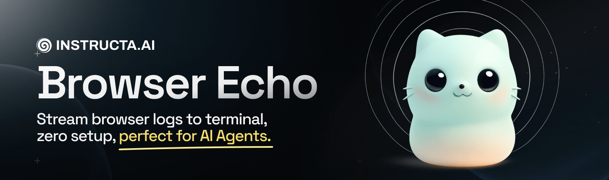

# Browser Echo



Stream browser `console.*` logs to your dev terminal and optional file logging.

`browser-echo` makes it easy for you (and your AI coding assistant) to read client-side logs directly in the server terminal during development.

## Features

🤖 **AI Coding Assistant Support** - Perfect for Cursor AI, Claude Code, GitHub Copilot CLI, Gemini CLI, and other code editors that read terminal output

🚀 **Framework Support** - React, Vue, Nuxt 3/4, Next.js, TanStack Start, Vite-based frameworks, and custom setups

No production impact. Providers enable this across frameworks by injecting a tiny client patch and exposing a dev-only HTTP endpoint.

## Quick start

| Framework | Quick Setup |
| --- | --- |
| TanStack / Vite | [Installation Guide](packages/vite/README.md) |
| Nuxt 3/4 | [Installation Guide](packages/nuxt/README.md) |
| Next.js (App Router) | [Installation Guide](packages/next/README.md) |
| Vue + Vite | **[Installation Guide](packages/vite/README.md#vue--vite) |
| React + Vite | **[Installation Guide](packages/vite/README.md#react--vite) |
| Vue (non-Vite) | [Installation Guide](packages/vue/README.md) |
| React (non-Vite) | [Installation Guide](packages/react/README.md) |
| Core | [Installation Guide](packages/core/README.md) |

> Framework users only install their provider + `@browser-echo/core`. No cross‑framework bloat.

## What you get

- Drop‑in client patch that wraps `console.log/info/warn/error/debug`
- Batched posts (uses `sendBeacon` when possible)
- Source hints `(file:line:col)` + stack traces
- Colorized terminal output
- Optional file logging (Vite provider only)
- Works great with AI assistants reading your terminal

## Options (shared shape)

Most providers accept these options (names may appear as plugin options or component props):

```ts
type BrowserLogLevel = 'log' | 'info' | 'warn' | 'error' | 'debug';

interface BrowserEchoOptions {
  enabled?: boolean;                 // default: true (dev only)
  route?: `/${string}`;              // default: '/__client-logs'
  include?: BrowserLogLevel[];       // default: ['log','info','warn','error','debug']
  preserveConsole?: boolean;         // default: true (also keep logging in the browser)
  tag?: string;                      // default: '[browser]'
  // stacks
  stackMode?: 'none' | 'condensed' | 'full'; // default: 'full' (provider-specific; Vite supports all)
  showSource?: boolean;              // default: true (when available)
  // batching
  batch?: { size?: number; interval?: number }; // default: 20 / 300ms
  // server-side
  truncate?: number;                 // default: 10_000 chars (Vite)
  fileLog?: { enabled?: boolean; dir?: string }; // Vite-only
}
```

> Note: File logging and `truncate` are currently implemented in the Vite plugin’s dev server middleware. Nuxt/Next providers print to stdout by default (you can extend them if you need file output there).

## Production

* Providers apply only in development and inject nothing into your production client bundles.
* If you also want to strip `console.*` in prod builds, use your bundler’s strip tools (e.g. Rollup plugin) separately.

## Troubleshooting

* No logs appear

  * Vite: ensure plugin is added and either `index.html` exists or you import the virtual module manually.
  * Nuxt: confirm the module is in `modules[]` and you’re in dev mode.
  * Next: make sure `app/__client-logs/route.ts` is exported and `<BrowserEchoScript />` is rendered in `<head>`.

* Endpoint 404

  * Using a custom `base` or proxy? Keep the route same‑origin and not behind auth.
  * Nuxt sometimes proxies dev servers; our module registers a Nitro route directly.

* Too noisy

  * Limit to `['warn','error']` and use `stackMode: 'condensed'`.

* Duplicate logs in browser

  * Set `preserveConsole: false`.

## License

MIT


## Links

- X/Twitter: [@kregenrek](https://x.com/kregenrek)
- Bluesky: [@kevinkern.dev](https://bsky.app/profile/kevinkern.dev)

## Courses
- Learn Cursor AI: [Ultimate Cursor Course](https://www.instructa.ai/en/cursor-ai)
- Learn to build software with AI: [AI Builder Hub](https://www.instructa.ai)

## See my other projects:

* [codefetch](https://github.com/regenrek/codefetch) - Turn code into Markdown for LLMs with one simple terminal command
* [instructa](https://github.com/orgs/instructa/repositories) - Instructa Projects
