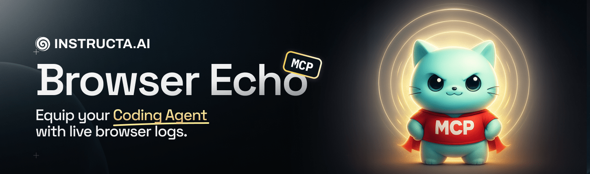

# Browser Echo MCP



`browser-echo` makes it easy for you to read client-side logs directly in your coding agent during development.

## Features

🤖 **AI Coding Assistant Support** - Perfect for Cursor AI, Claude Code, GitHub Copilot CLI, Gemini CLI, and other code editors that read terminal output

🚀 **Framework Support** - React, Vue, Nuxt 3/4, Next.js, TanStack Start, Vite-based frameworks, and custom setups


## Quick start

#### 1. Install Framework Package

First, set up Browser Echo for your framework:

| Framework | Quick Setup |
| --- | --- |
| TanStack / Vite | [Installation Guide](packages/vite/README.md#tanstack-start) |
| Nuxt 3/4 | [Installation Guide](packages/nuxt/README.md) |
| Next.js (App Router) | [Installation Guide](packages/next/README.md) |
| Vue + Vite | [Installation Guide](packages/vite/README.md#vue--vite) |
| React + Vite | [Installation Guide](packages/vite/README.md#react--vite) |
| Vue (non-Vite) | [Installation Guide](packages/vue/README.md) |
| React (non-Vite) | [Installation Guide](packages/react/README.md) |
| Core | [Installation Guide](packages/core/README.md) |

#### 2. Use Browser Echo MCP

**⚠️ IMPORTANT:** You **must complete step 1** (framework setup) first before MCP will work. The MCP server needs your frameworks server to forward browser logs to it.

**📖 [Set up Browser Echo MCP Server](packages/mcp/README.md)** for AI assistant integration

## Browser Echo Core (Terminal only)


Stream browser `console.*` logs to your dev terminal and optional file logging.

`browser-echo` makes it easy for you (and your AI coding assistant) to read client-side logs directly in the server terminal during development.

> 💡 **Tip**: The MCP server isn't required for most use cases. AI assistants are usually smart enough to read CLI output directly, and the terminal solution is often faster and cheaper than MCP integration. The MCP was designed to avoid polluting the context window, but in most cases the terminal output is sufficient.


- Drop‑in client patch that wraps `console.log/info/warn/error/debug`
- Batched posts (uses `sendBeacon` when possible)
- Source hints `(file:line:col)` + stack traces
- Colorized terminal output
- Optional file logging (Vite provider only)
- Works great with AI assistants reading your terminal
 - Optional network capture (opt‑in): fetch, XMLHttpRequest, WebSocket

## Production

No production impact. Providers enable this across frameworks by injecting a tiny client patch and exposing a dev-only HTTP endpoint.

* Providers apply only in development and inject nothing into your production client bundles.
* If you also want to strip `console.*` in prod builds, use your bundler’s strip tools (e.g. Rollup plugin) separately.

## FAQ / Troubleshooting

<details>
<summary>The MCP doesn't show any logs</summary>

1. **Make sure you have installed framework support** → See [Install Framework Package](#1-install-framework-package) above
2. **Ensure your development server is running** before starting the MCP server
3. **Restart the MCP server** if logs still don't appear:
   - **In Cursor:** Settings → MCP & Integrations → toggle "browser-echo" off and on
   - **In Claude Code:** Type `/mcp` → Choose "browser-echo" → Enter → Hit `2` to reconnect

</details>

<details>
<summary>No logs appear (framework setup issues)</summary>

* **Vite:** Ensure plugin is added and either `index.html` exists or you import the virtual module manually
* **Nuxt:** Confirm the module is in `modules[]` and you're in dev mode
* **Next.js:** Make sure `app/api/client-logs/route.ts` is exported and `<BrowserEchoScript />` is rendered in `<head>`

</details>

<details>
<summary>Getting 404 errors on log endpoints</summary>

* Using a custom `base` or proxy? Keep the route same‑origin and not behind auth
* Nuxt sometimes proxies dev servers; our module registers a Nitro route directly

</details>

<details>
<summary>Too many/noisy logs</summary>

* Limit to `['warn','error']` and use `stackMode: 'condensed'`

</details>

<details>
<summary>Seeing duplicate logs in browser</summary>

* Set `preserveConsole: false` in your configuration

</details>

<details>
<summary>I see logs from other running projects (multiple client setup)</summary>

If you're running multiple MCP servers in different projects and seeing logs from unrelated projects, ensure each project has its own `.browser-echo-mcp.json` file in its root directory:

1. **Check for ancestor config files**: Look for `.browser-echo-mcp.json` files in parent directories (e.g., `~/projects/.browser-echo-mcp.json`). If found, delete them or move them to specific project roots.

2. **Use distinct ports**: Start each MCP server with a unique port:
   ```bash
   # In project A
   browser-echo-mcp --port 5179

   # In project B
   browser-echo-mcp --port 5180
   ```

3. **Verify project isolation**: Ensure each MCP server was started from within its own project directory (not from a shared parent).

4. **Check process CWD**: If using IDE integrations or task runners, make sure each MCP server process has its `CWD` set to the individual project root.

If the issue persists after following these steps, please [open an issue on GitHub](https://github.com/regenrek/vite-browser-logs/issues) with details about your setup.

</details>

## License

MIT


## Links

- X/Twitter: [@kregenrek](https://x.com/kregenrek)
- Bluesky: [@kevinkern.dev](https://bsky.app/profile/kevinkern.dev)

## Courses
- Learn Cursor AI: [Ultimate Cursor Course](https://www.instructa.ai/en/cursor-ai)
- Learn to build software with AI: [AI Builder Hub](https://www.instructa.ai)

## See my other projects:

* [codefetch](https://github.com/regenrek/codefetch) - Turn code into Markdown for LLMs with one simple terminal command
* [instructa](https://github.com/orgs/instructa/repositories) - Instructa Projects
